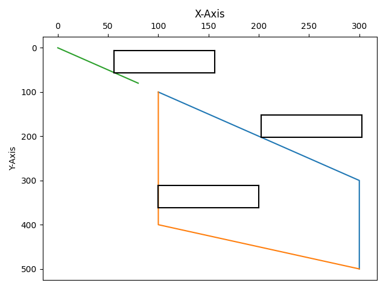

# Polyline Label Placement

This is a program that accepts multiple lines as X, Y coordinates and generates 
Polylines for every line and also generates label boxes for every polyline.

## Running it on your machine
```bash
git clone https://github.com/anishLearnsToCode/polyline-label-placement
cd polyline-label-placement

# install all dependencies
pip install -r requirements.txt

cd src
python test.py data_1.txt
```

This will output label coordinates and also label positions like 
`top-right`, `bottom-left` etc as such

````text
100 100 bottom-right
50 56.45 top-left
...
````

This will also display the graph of multiple polylines and label boxes.


